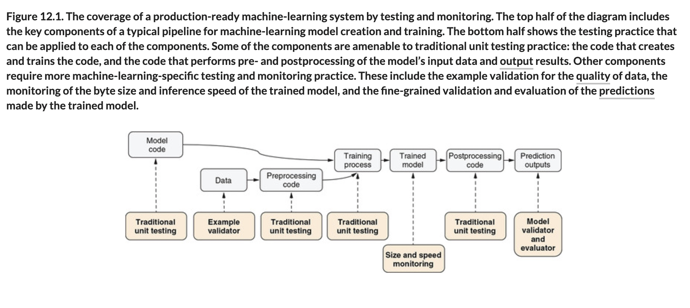

# 💊 Testing TF.js Models

## [**12.1.** Testing TensorFlow.js models](https://livebook.manning.com/book/deep-learning-with-javascript/chapter-12/2)

## Sub-Chapters

- **12.1.1.** [[12-1-1-traditional-unit-test]]
- **12.1.2.** [[12-1-2-testing-golden-values]]
- **12.1.3.** [[12-1-3-continuous-training]]

---

### [**Figure 12.1.** The coverage of a production-ready machine-learning system by testing and monitoring.](https://livebook.manning.com/book/deep-learning-with-javascript/chapter-12/ch12fig01)

---

## **Vocabulary**

- **training**
- **weights**

<link rel="stylesheet" type="text/css" media="all" href="../../../assets/css/custom.css" />

---

from [[_12-testing-optim]]

[//begin]: # "Autogenerated link references for markdown compatibility"
[12-1-1-traditional-unit-test]: 12-1-1-traditional-unit-test.md "💊 Traditional Unit Test"
[12-1-2-testing-golden-values]: 12-1-2-testing-golden-values.md "💊 Testing Golden Values"
[12-1-3-continuous-training]: 12-1-3-continuous-training.md "💊 Cont. Training"
[_12-testing-optim]: ../_12-testing-optim.md "💊 12 TESTING OPTIM"
[//end]: # "Autogenerated link references"
