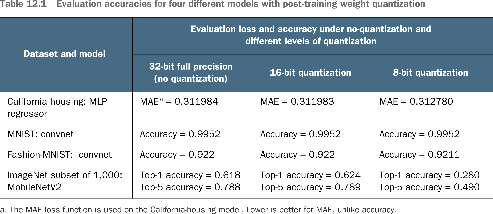
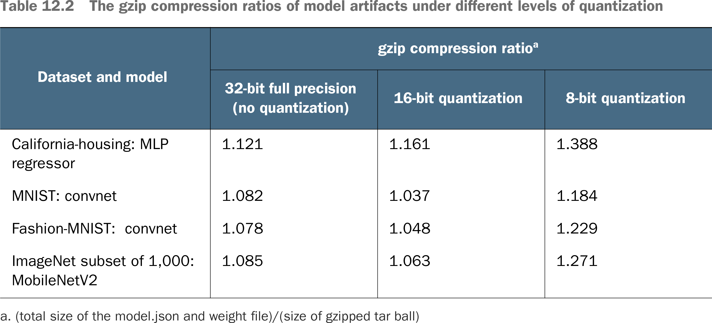

# 💊 Post Train Weight Quantization

## [**12.2.1.** **Model-size optimization** through **post-training weight quantization**](https://livebook.manning.com/book/deep-learning-with-javascript/chapter-12/56)

---

## [**Table 12.1** Evaluation accuracies for four different models with post-training weight quantization](https://livebook.manning.com/book/deep-learning-with-javascript/chapter-12/ch12table01)

## [**Table 12.2** The gzip compression ratios of model artifacts under different levels of quantization](https://livebook.manning.com/book/deep-learning-with-javascript/chapter-12/ch12table02)

---

## **Vocabulary**

- **predicting**
- **overfitting**
- **conclusion**
- **loss function**
- **MNIST Dataset**
- **`argMax()`**
- **Fashion NIST dataset**
- **pretrained model**
- **ACGAN**
- **gzip compression**
- **repeating patterns**
- **observation**
- **binary**
- **tensors**

<link rel="stylesheet" type="text/css" media="all" href="../../../assets/css/custom.css" />

---

from [[_12-2-model-optim]]

[//begin]: # "Autogenerated link references for markdown compatibility"
[_12-2-model-optim]: _12-2-model-optim.md "💊 Model Optim"
[//end]: # "Autogenerated link references"
