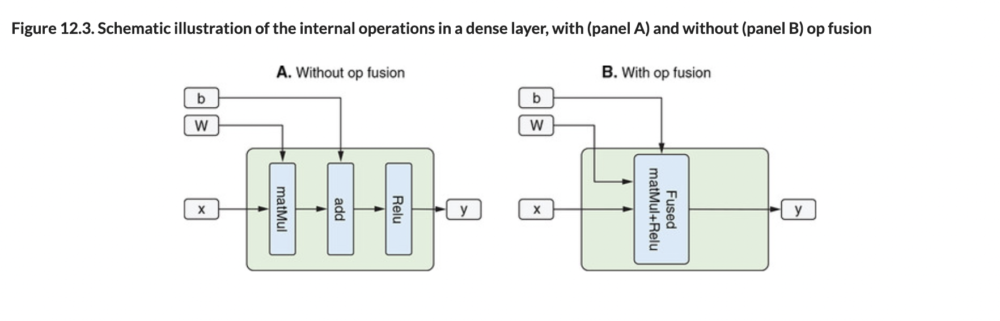

# 💊 Inference Speed Optim Graph Modeling

## [**12.2.2.** **Inference-speed optimization** using **GraphModel conversion**](https://livebook.manning.com/book/deep-learning-with-javascript/chapter-12/114)

---

## [**Figure 12.3.** Schematic illustration of the internal operations in a dense layer, with (panel A) and without (panel B) op fusion](https://livebook.manning.com/book/deep-learning-with-javascript/chapter-12/ch12fig03)

---

## **Vocabulary**

- <b>GraphModel</b>
- <b>`tf.GraphModel`</b>
- <b>`tf.loadGraphModel()`\*\*
- <b>relu activation</b>
- <b>graph</b>
- <b>fine granularity</b>
- <b>ahead-of-time analysis</b>
- <b>fine granularity</b>
- <b>Batch Normalization layer</b>
- <b>`tf.layers.batchNormalization()`</b>
- <b>`predict()`</b>
- <b>Layers API</b>
- <b>op fusion</b>
- <b>`tf.layers.dense()`</b>
- <b>matrix multiplication</b>
- <b>kernel</b>
- <b>`Fused malMul+relu`</b>
- <b>`tensorflowjs_ converter`</b>
- <b>`console.timeEnd()`</b>

<link rel="stylesheet" type="text/css" media="all" href="../../../assets/css/custom.css" />

---

from [[_12-2-model-optim]]

[//begin]: # "Autogenerated link references for markdown compatibility"
[_12-2-model-optim]: _12-2-model-optim.md "💊 Model Optim"
[//end]: # "Autogenerated link references"
