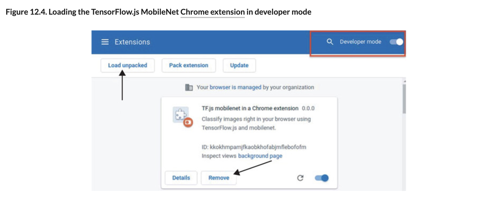

# 💊 Chrome Extension

## [**12.3.3.** Deploying to a browser extension, like Chrome Extension](https://livebook.manning.com/book/deep-learning-with-javascript/chapter-12/183)

---

## [**Figure 12.4.** Loading the TensorFlow.js MobileNet Chrome extension in developer mode](https://livebook.manning.com/book/deep-learning-with-javascript/chapter-12/ch12fig04)

## [**Figure 12.5.** The TensorFlow.js MobileNet Chrome extension helps classify images in a web page.](https://livebook.manning.com/book/deep-learning-with-javascript/chapter-12/ch12fig05)

---

from [[_12-3-deploy-tf-js-models-on-plats-env]]

[//begin]: # "Autogenerated link references for markdown compatibility"
[_12-3-deploy-tf-js-models-on-plats-env]: _12-3-deploy-tf-js-models-on-plats-env.md "💊 Deploy TF.js Model on on Plats Env"
[//end]: # "Autogenerated link references"
