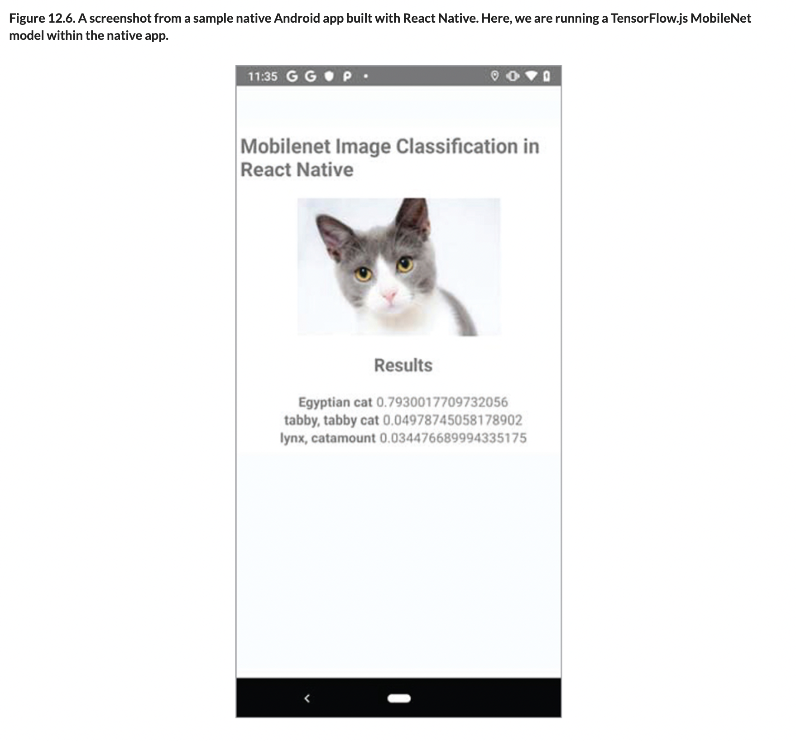

# 💊 Mobile Apps

## [**12.3.4.** Deploying TensorFlow.js models in JavaScript-based mobile applications](https://livebook.manning.com/book/deep-learning-with-javascript/chapter-12/195)

---

## [**Figure 12.6.** A screenshot from a sample native Android app built with React Native. Here, we are running a TensorFlow.js MobileNet model within the native app.](https://livebook.manning.com/book/deep-learning-with-javascript/chapter-12/ch12fig06)

---

from [[_12-3-deploy-tf-js-models-on-plats-env]]

[//begin]: # "Autogenerated link references for markdown compatibility"
[_12-3-deploy-tf-js-models-on-plats-env]: _12-3-deploy-tf-js-models-on-plats-env.md "💊 Deploy TF.js Model on on Plats Env"
[//end]: # "Autogenerated link references"
