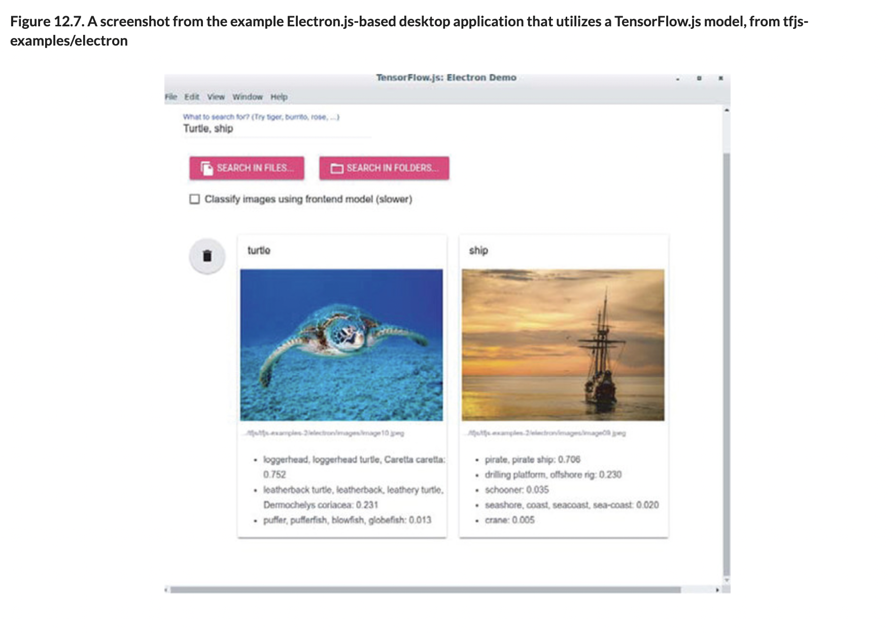
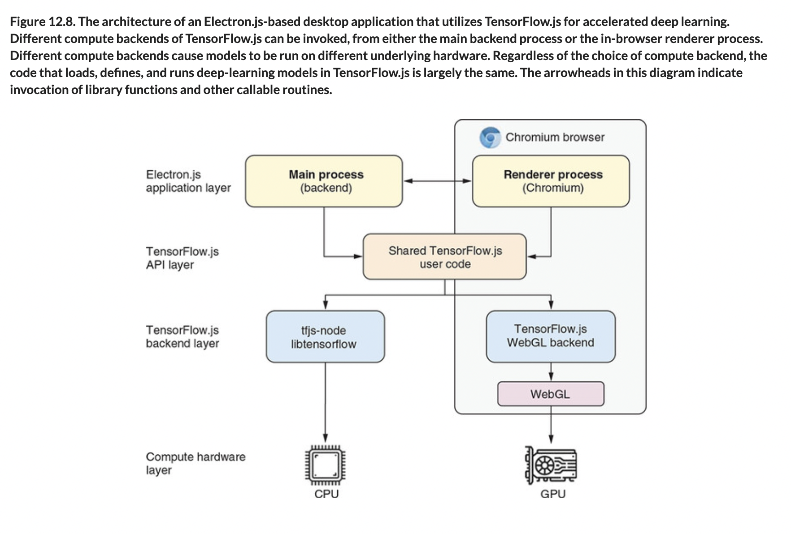

# 💊 Model Cross Apps

## [**12.3.5.** Deploying TensorFlow.js models in JavaScript-based cross-platform- m desktop applications](https://livebook.manning.com/book/deep-learning-with-javascript/chapter-12/204)

---

## [**Figure 12.7.** A screenshot from the example Electron.js-based desktop application that utilizes a TensorFlow.js model, from tfjs-examples/electron](https://livebook.manning.com/book/deep-learning-with-javascript/list-of-figures/1)

## [**Figure 12.8.** The architecture of an Electron.js-based desktop application that utilizes TensorFlow.js for accelerated deep learning.](https://livebook.manning.com/book/deep-learning-with-javascript/chapter-12/ch12fig08)

---

from [[_12-3-deploy-tf-js-models-on-plats-env]]

[//begin]: # "Autogenerated link references for markdown compatibility"
[_12-3-deploy-tf-js-models-on-plats-env]: _12-3-deploy-tf-js-models-on-plats-env.md "💊 Deploy TF.js Model on on Plats Env"
[//end]: # "Autogenerated link references"
