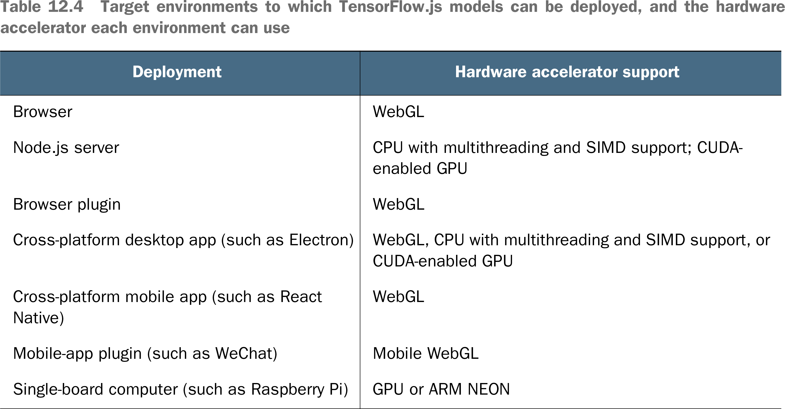

# 💊 Summary Deploy

## [**12.3.8.** Summary of deployments](https://livebook.manning.com/book/deep-learning-with-javascript/chapter-12/1)

---

## [**Table 12.4** Target environments to which TensorFlow.js models can be deployed, and the hardware accelerator each environment can use](https://livebook.manning.com/book/deep-learning-with-javascript/chapter-12/ch12table04)

---

from [[_12-3-deploy-tf-js-models-on-plats-env]]

[//begin]: # "Autogenerated link references for markdown compatibility"
[_12-3-deploy-tf-js-models-on-plats-env]: _12-3-deploy-tf-js-models-on-plats-env.md "💊 Deploy TF.js Model on on Plats Env"
[//end]: # "Autogenerated link references"
