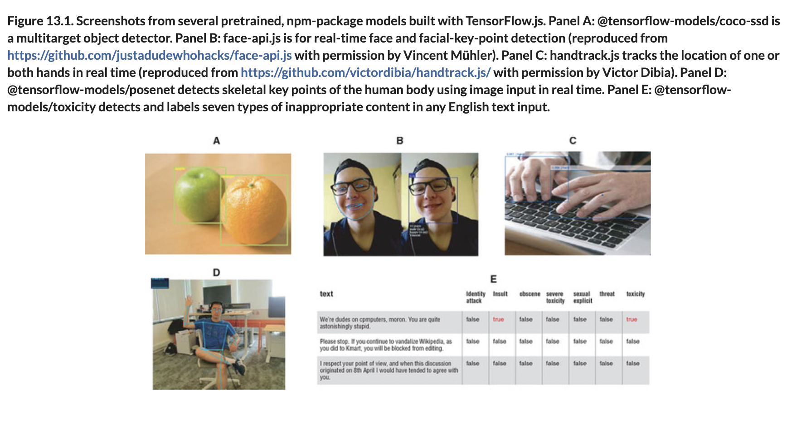

# 🎓 Pre-Trained TF.js Models

## [**13.2.3.** Using pretrained models from TensorFlow.js](https://livebook.manning.com/book/deep-learning-with-javascript/chapter-13/100)

## [**Figure 13.1 Several Pretrained TensorFlow NPM Models**](https://livebook.manning.com/book/deep-learning-with-javascript/chapter-13/ch13fig01)

---

## **Vocabulary**

- <b>Node.js projects</b>
- <b>ImageNet</b>
- <b>Object detection</b>
- <b>Human Interactions</b>
- <b>WebAudio API</b>
- <b>encoder</b>
- <b>vocabulary (user-specific voice adaptation)</b>
- <b>PoseNet</b>
- <b>ML5.js</b>
- <b>MusicRNN</b>

<link rel="stylesheet" type="text/css" media="all" href="../../../assets/css/custom.css" />

---

from [[_13-2-overview-dl-algo-tf-js]]

[//begin]: # "Autogenerated link references for markdown compatibility"
[_13-2-overview-dl-algo-tf-js]: _13-2-overview-dl-algo-tf-js.md "🎓 DL Algo TF.js"
[//end]: # "Autogenerated link references"
