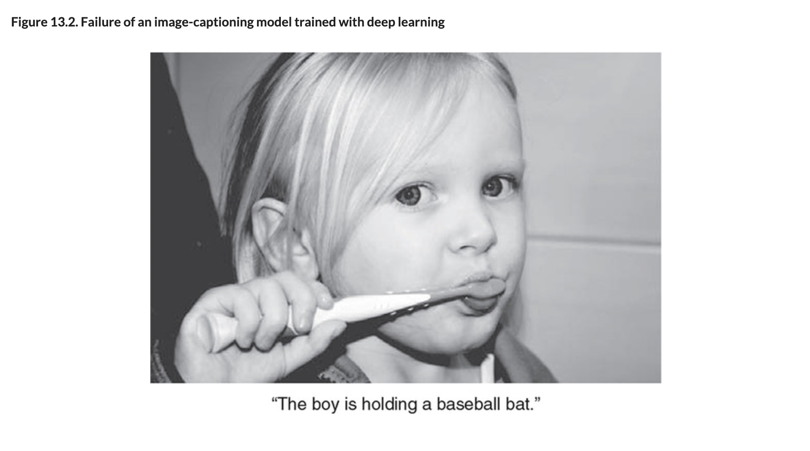
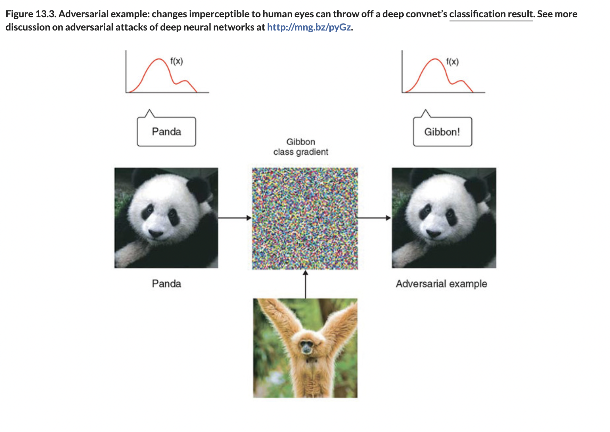
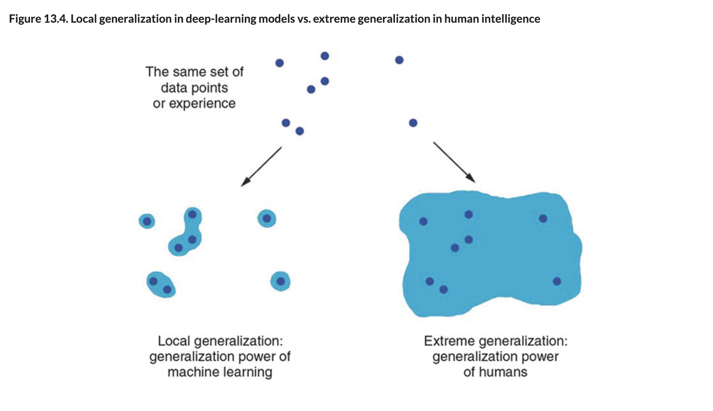

# Limits of DL

## [**13.2.5.** Limitations of deep learning](https://livebook.manning.com/book/deep-learning-with-javascript/chapter-13/127)

---

### [**Figure 13.2.** Failure of an image-captioning model trained with deep learning](https://livebook.manning.com/book/deep-learning-with-javascript/chapter-13/ch13fig02)

### [**Figure 13.3.** Adversarial example: changes imperceptible to human eyes can throw off a deep convnet’s classification result.](https://livebook.manning.com/book/deep-learning-with-javascript/chapter-13/ch13fig03)

### [**Figure 13.4.** Local generalization in deep-learning models vs. extreme generalization in human intelligence](https://livebook.manning.com/book/deep-learning-with-javascript/chapter-13/ch13fig04)

---

## **Vocabulary**

- **Anthropomorphization**
- **Adversarial examples**
- **Convnet Filters**
- **Gradient Ascent**
- **Input space**
- **Local Generalization**

---

from [[_13-2-overview-dl-algo-tf-js]]

[//begin]: # "Autogenerated link references for markdown compatibility"
[_13-2-overview-dl-algo-tf-js]: _13-2-overview-dl-algo-tf-js.md "🎓 DL Algo TF.js"
[//end]: # "Autogenerated link references"
